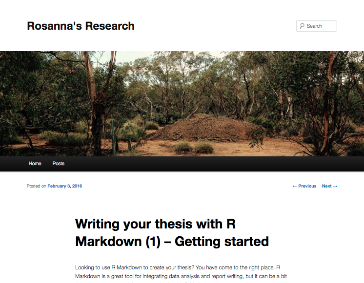

Dissertation, Thesis, or Project   with Knitr and Markdown
========================================================
1. Motivation
    + Reproducibility
    + Integrate data analysis and report writing
    + Plain text! Focus on content not formatting (back end)
2. Toolkit
    + Reference manager (.bib file)
    + Citation style (.csl file)
    + R Studio (Knitr and Bookdown packages)
3. Making it work for you (example)
    + https://goo.gl/XMtGnT

Motivation
========================================================

Image source: [rosannavanhespenresearch.wordpress.com](https://rosannavanhespenresearch.wordpress.com/2016/02/03/writing-your-thesis-with-r-markdown-1-getting-started/)

Toolkit
========================================================
* Reference manager that can export to BibTeX (.bib file)
    + BibTeX: Plain text tool and file format for processing lists of references (LaTeX documents)
    + Examples: [Zotero](https://libguides.mit.edu/ld.php?content_id=34248570), [Mendeley](http://guides.library.ubc.ca/bibtex/mendeley), [EndNote](https://www.rhizobia.co.nz/latex/convert), [Paperpile](http://forum.paperpile.com/t/how-to-export-a-document-and-citations-to-latex-and-bibtex/784)

* Preferred citation style (.csl file)
    + Citation Style Language (.csl): XML-based language for formatting citations and bibliographies
    + Reference managers need descriptions of each citation style in language computer can understand
    + GitHub has a [repository of ~8500+ .csl files](https://github.com/citation-style-language/styles)
    + Example: [Council of Science Editors](https://writing.wisc.edu/Handbook/DocCSE.html)
    
* R Studio
    + [Knitr package (Yihui Xie)](https://yihui.name/knitr/)
    + [Bookdown package (Yihui Xie)](https://bookdown.org/yihui/bookdown/)
    + YAML: An R Markdown file always has a formatting header ('front matter') written in [YAML syntax](https://en.wikipedia.org/wiki/YAML)
    
References
========================================================

1. Stack Overflow
2. Dr. Google
3. R Markdown & R Studio Resources
    + [R Studio Intro](http://rmarkdown.rstudio.com/lesson-1.html)
    + [Authoring Bibliographies and Citations](http://rmarkdown.rstudio.com/authoring_bibliographies_and_citations.html)
    + [Knitr Package (Yihui Xie)](https://yihui.name/knitr/)
    + [Bookdown Package (Yihui Xie)](https://bookdown.org/yihui/bookdown/)
4. $\LaTeX$ ("Lay-tech" or "La-tech")
    + [LaTeX Wiki](https://en.wikipedia.org/wiki/LaTeX)
    + [LaTeX Website](https://www.latex-project.org/)
5. Managing References for LaTeX use (.bib files)
    + [Bibdesk (Apple-Mac)](http://bibdesk.sourceforge.net/)
    + [JabRef](http://www.jabref.org/)
    + [Others](https://tex.stackexchange.com/questions/9454/bibdesk-like-software-for-windows)
6. Citation Style Langauge Resources (.csl files)
    + [CSL Primer](http://docs.citationstyles.org/en/stable/primer.html)
    + [GitHub Repository](https://github.com/citation-style-language/styles)
    + [CSL Editor](http://editor.citationstyles.org/about/)
7. Example Thesis and Templates for Academic Manuscripts
    + [Rosanna's Research](https://rosannavanhespenresearch.wordpress.com/2016/02/03/writing-your-thesis-with-r-markdown-1-getting-started/)
    + [An R Markdown Template for Academic Manuscripts](http://svmiller.com/blog/2016/02/svm-r-markdown-manuscript/)

